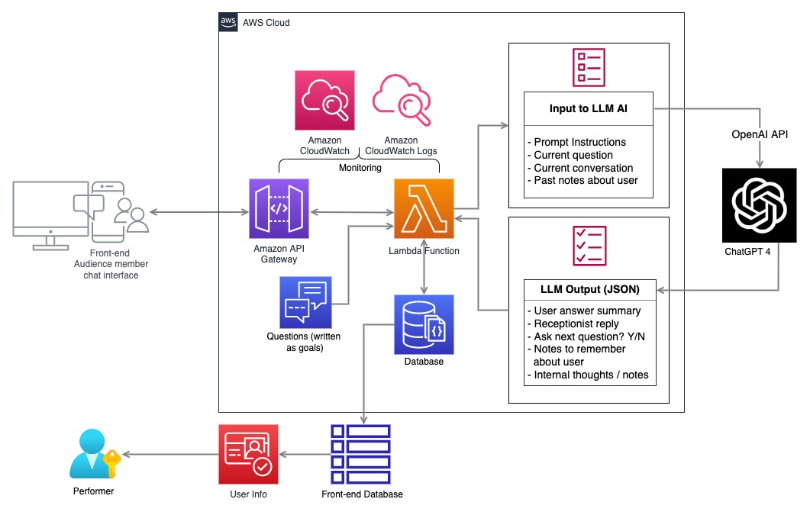
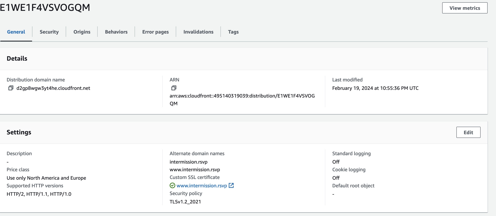
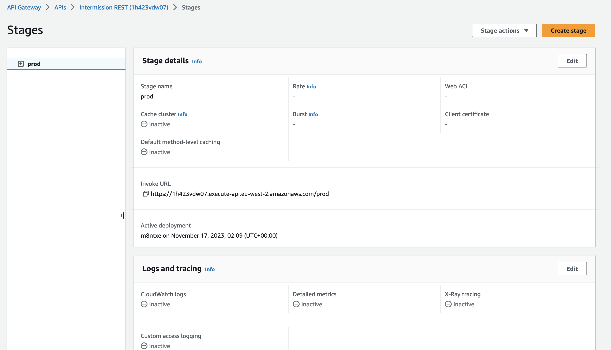

# Intermission - AI Receptionist ("Amy")

An LLM powered conversational agent that ran the pre-show intake for **Intermission**, a live immersive wellness experience. Each audience member was greeted by *Amy*, an in-character AI receptionist who interviewed them through a multi-stage questionnaire, extracted structured answers from a free-flowing conversation, and wrote them in real time to a shared sheet the performers used to personalise each guest's show.

In the days before each visit, performers used a guest's questionnaire answers (their mood, what they're grateful for, a place that calms them) to craft a bespoke, 1-to-1 experience built around them. The conversation also moved into genuinely sensitive territory, asking what difficulties a guest was facing or what they'd want to change in their life, so Amy had to draw out honest, personal answers while holding those moments with care. The responses were the foundation the whole experience was built on, so the agent's accuracy and reliability mattered as much as its warmth.

It was built in 3-4 days and deployed to real users on AWS, behind a custom domain, in early 2024.

> **Note on status:** the live experience has been decommissioned, so the public URL is offline. This repository contains the application source and deployment evidence (below).

<!-- DEMO: once the Loom walkthrough is recorded, surface it here near the top, e.g.
**▶ [Watch a 3-minute demo](LOOM_URL)** - Amy running locally, end to end. -->

---

## What it did

- Greeted each guest in character and ran them through a **~25-step intake** - practical fields (name, pronouns, booking time, allergies, access needs) flowing naturally into reflective prompts (what they're grateful for, what they're looking forward to, an imagined "miracle" version of their life).
- Held a **real conversation per question** rather than firing a rigid form - it could stay on a question to draw out a shallow answer, then move on once it had enough depth.
- **Extracted structured data** from each exchange and wrote it to a sheet that performers read live, including private "internal notes" to help them tailor the show.
- Survived the messiness of real use: page refreshes, mid-session rejoins, rate limits, and malformed model output.

## Architecture



*Architecture diagram.*

- **`lambda_function.py`** - API Gateway entry point. CORS handling, request validation, error-to-status-code mapping (rate limits → 503, bad model output → 500, unknown user → 401).
- **`questionnaire.py`** - the conversation state machine: tracks which goal the user is on, assembles per-goal context, decides when a goal is satisfied, and handles session-resume edge cases.
- **`receptionist.py`** - the LLM boundary. Calls GPT-4 and parses the reply into structured JSON.
- **`user.py` / `storage.py` / `google_sheet_wrapper.py`** - per-user persistence behind a two-method store interface. Production uses Google Sheets (the performers' live view); `storage.InMemoryStore` runs the exact same conversation logic locally with no external dependencies.
- **`cli.py`** - an interactive terminal runner for the agent (needs only an OpenAI key).
- **`frontend/`** - the guest-facing experience: a vanilla HTML/CSS/JS single page with a word-by-word typewriter reveal, ambient audio that fades in, timed "thinking" pauses, and in-character error states. No framework, no build step. Each guest entered via a unique `?u=<id>` link.
- **`devserver.py`** - a small Flask server that serves the frontend and bridges it to the agent, so the whole experience runs locally end-to-end.
- **`prompts/`** - the versioned system prompts (v1 → v2) that define Amy's character and the strict JSON output contract.

## The interesting engineering

**1. Structured output before there were tools for it.** This shipped on `gpt-4` before JSON mode or function calling were available. The prompt (`prompts/prompt_v2.txt`) defines a strict contract - every turn returns:

```json
{
  "users_answer_to_goal": "...the recorded answer, or null",
  "history_to_add": "...durable facts about the user, or null",
  "internal_comment": "...private note for performers, or null",
  "should_ask_next_question": true,
  "amys_response": "...what the guest actually sees"
}
```

That one schema does four jobs at once: it captures the answer, accumulates long-term memory, leaves notes for the human performers, and controls the flow - all while keeping the user-facing reply in character.

**2. Defensive JSON parsing.** LLMs return *almost*-valid JSON under pressure. `receptionist.py` extracts the JSON object with a regex, and on a parse failure runs a repair pass that escapes raw newlines inside string values before retrying - instead of just dropping the turn. (`_parse_reply` / `escape_newlines_in_json_strings`.)

**3. Flow correction.** The model would sometimes try to advance the conversation when it shouldn't (e.g. a user rejoining mid-session). The state machine detects these cases and overrides the model's `should_ask_next_question` decision rather than trusting it blindly.

## Data & privacy

The intake handles personal and special-category data (under GDPR, the allergy
and injury fields count as health data), so data protection is treated as a
first-class concern:

- **Consent & transparency** - clear notice of what's collected, why, and that
  performers read the responses live.
- **Data minimisation** - collecting only what the experience actually uses.
- **Retention & deletion** - a defined data lifetime and per-guest erasure.
- **Access control** - the pluggable storage layer (`storage.py`) makes moving
  from a shared sheet to an authenticated, least-privilege backend a one-class
  change as sensitivity or scale demands.
- **Processor awareness** - Google (Sheets) and OpenAI act as sub-processors of
  the data.

## Deployment evidence

Served over HTTPS from a custom domain via CloudFront:



Backed by API Gateway routing to Lambda:



## Press & reception

Intermission was produced by [Riptide](https://www.theriptide.co.uk/), an immersive theatre company. Each audience member had a bespoke experience, guided one at a time through a series of eight-minute treatments (massage, VR meditation, life coaching, guided writing, a perfect cup of tea), with the in-person cast working alongside "pioneering AI technology used to deliver personalised aspects to the piece." Amy ran the intake behind those personalisations. A short film of the experience (not the AI intake) is on [Vimeo](https://vimeo.com/921578262), and Riptide's [about page](https://www.theriptide.co.uk/aboutintermission) covers the production in more depth.

From the Yorkshire Post review:

> "Firstly, you complete a pre-performance questionnaire positioned as a gentle virtual conversation in a zen consultation room. Although I can only assume this was done via AI, I was astounded by the soothing and intuitive way it was conducted, setting the tone perfectly for the cast members I encountered during the actual performance."

From another review:

> "I was ... invited to complete a questionnaire before commencing my journey. I had initially assumed that the positive encouragement I received to my responses was computer generated, but I was assured that a real person oversees the process. Information is also gathered during the process and fed forward to the person who speaks to you in the final room."

Alex Palmer, Artistic Director of Riptide, on the use of AI:

> "It's a matter of how you can harness the technology for good. The AI helps us track the choices that make it feel more bespoke ..."

## Running it

**Locally (no AWS, no Google Sheets) - just an OpenAI key:**

```bash
pip install openai
export OPENAI_API_KEY=sk-...
python cli.py
```

This runs a full conversation with Amy in your terminal, backed by the
in-memory store.

To run it for **free** (no OpenAI billing), point it at any OpenAI-compatible
endpoint - e.g. Groq's free tier or a local Ollama server:

```bash
export OPENAI_API_KEY=<your-groq-key>
export OPENAI_BASE_URL=https://api.groq.com/openai/v1
export OPENAI_MODEL=llama-3.3-70b-versatile
python cli.py
```

**The full experience (frontend + agent) locally:**

```bash
pip install flask openai
export OPENAI_API_KEY=sk-...        # or a free Groq/Ollama endpoint, as above
python devserver.py
# open http://localhost:5000/?u=guest
```

This serves the immersive frontend and runs the conversation against the
in-memory store - the same end-to-end flow that ran in production, minus AWS.

**Against the production stack** (Google Sheets + Lambda handler):

```bash
pip install -r requirements.txt
cp .env.example .env   # fill in OPENAI_API_KEY, INTERMISSION_SHEET_ID, service-account path
python lambda_function.py   # invokes the handler once as a smoke test
```

All credentials are read from the environment.

## Stack

Python · Flask · Vanilla JS/HTML/CSS · AWS Lambda · API Gateway · CloudFront · OpenAI GPT-4 · Google Sheets API
